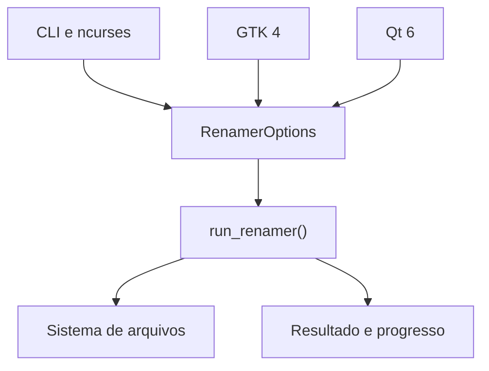

# Arquitetura e segurança

## Visão geral

O projeto separa apresentação e operação:



`src/core.cpp` não depende de ncurses, GTK ou Qt. As interfaces apenas coletam
opções, mostram progresso e apresentam o resultado.

## Fases de uma requisição

1. **Validação:** confere caminho, presença de transformação e parâmetros.
2. **Normalização:** converte alvo e exclusões em caminhos absolutos lexicamente
   normalizados e identifica o executável atual.
3. **Contagem:** percorre a árvore sem alterações para determinar o total da
   barra, respeitando recursão, exclusões e links.
4. **Planejamento:** calcula o nome final de cada item.
5. **Conflitos:** detecta destinos duplicados e destinos já existentes.
6. **Execução:** move o lote para nomes temporários exclusivos e depois para os
   destinos finais.
7. **Relatório:** agrega mensagens, estatísticas e fecha o progresso em 100%.

## Renomeação sem sobrescrita

Toda mudança efetiva usa a chamada Linux:

```text
renameat2(..., RENAME_NOREPLACE)
```

Se o kernel não disponibilizar `renameat2`, o programa falha com segurança. Ele
não recua para `rename()`, porque essa função poderia substituir um destino.

## Operação em duas etapas

Para cada diretório, os itens ativos passam por:

```text
nome original -> .fix-names-tmp-PID-CONTADOR -> nome final
```

Isso permite cadeias e trocas de nomes dentro do mesmo diretório sem escolher
um item arbitrariamente. Os temporários incorporam PID e contador e só são
aceitos quando o nome ainda não existe.

Se uma fase falha, o núcleo tenta reverter destinos já finalizados para seus
temporários e depois restaurar todos os nomes originais. Falhas de reversão são
marcadas como `ERRO CRÍTICO` no relatório.

## Detecção de conflitos

Um item é preservado quando:

- dois ou mais itens produziriam o mesmo nome final;
- o destino já existe e não é a origem ativa de outra mudança do mesmo lote;
- o resultado seria vazio, `.` ou `..`;
- o resultado conteria `/` ou NUL;
- não foi possível examinar a entrada com segurança.

Quando dois itens colidem, nenhum é escolhido. Todos permanecem com o nome
original, aparecem como conflito e fazem `RunResult.success` ser falso.

## Links simbólicos

O núcleo consulta `symlink_status()`, não segue o alvo e não entra em links que
apontem para diretórios. O link em si pode ser renomeado como uma entrada
normal. A extensão do nome do link fica protegida por padrão.

## Exclusões

Exclusões são comparadas por componentes de caminho, evitando que uma pasta
como `/dados/foto` proteja por engano `/dados/fotografias`. Uma exclusão de
diretório abrange a própria pasta e toda a árvore abaixo.

O caminho obtido de `/proc/self/exe` é excluído automaticamente, impedindo que
o processo renomeie o próprio binário quando ele estiver dentro da árvore-alvo.

## Proteções de escopo

- `EUID == 0` é recusado nas interfaces e novamente no núcleo.
- O alvo absoluto `/` é recusado.
- Recursão precisa ser ativada explicitamente.
- A pasta-alvo não é renomeada quando é um diretório.
- Permissões negadas durante a enumeração são ignoradas na passagem de contagem
  e registradas na passagem efetiva quando impedem a operação.

## Unicode e nomes inválidos

O núcleo possui decodificador UTF-8 próprio para contar caracteres e aplicar
transformações. Sequências UTF-8 inválidas são preservadas byte por byte.
Caracteres de controle em caminhos de relatório são escapados como `\n`,
`\r`, `\t` ou `\xNN`, para não controlar a saída do terminal.

A conversão de maiúsculas/minúsculas usa a localidade ativa do processo. A
remoção de acentos combina uma tabela determinística para letras latinas com a
remoção de faixas Unicode de marcas combinantes.

## Progresso

O total é contado antes da primeira alteração. O callback recebe
`(concluídos, total)` e nunca um percentual aproximado. A função compartilhada
`progress_percentage()` calcula de `0` a `100` sem realizar `completed * 100`,
evitando estouro de `size_t`.

Se a árvore for alterada por outro processo entre a contagem e a execução, o
contador é saturado no total. A conclusão força `total/total` sem falsificar as
estatísticas.

## Limites conhecidos

- O projeto é específico para Linux.
- Não há mecanismo de desfazer persistente depois de uma execução concluída;
  a reversão existe apenas para falhas dentro do lote atual.
- O programa não coordena travas com outros processos que alterem a mesma
  árvore ao mesmo tempo.
- Busca/substituição é literal, sem regex.
- Espaços e sublinhados tratados são os caracteres ASCII correspondentes.
- A interpretação de maiúsculas/minúsculas depende da localidade disponível.
